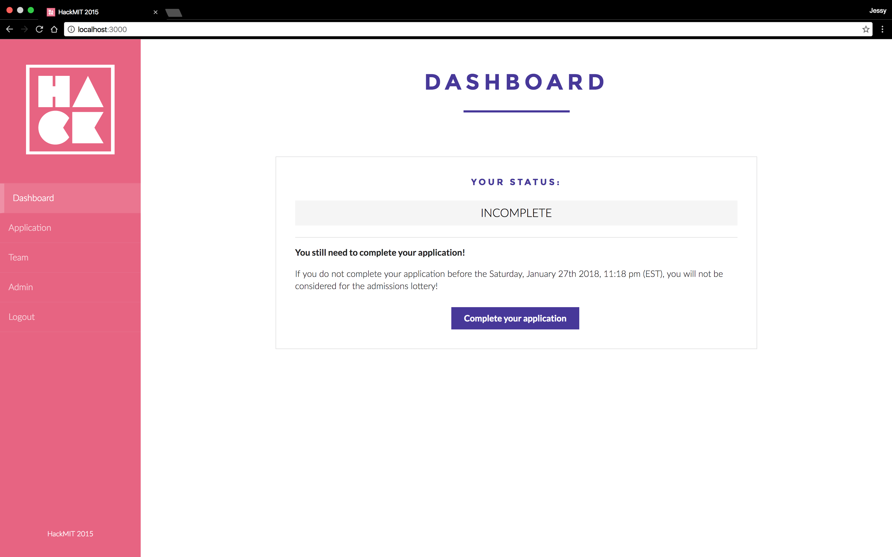
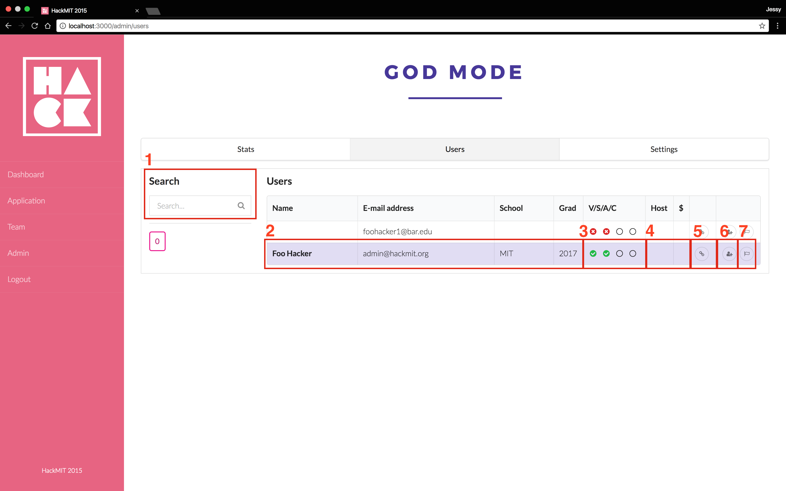

# Quill

## *Registration, for hackers!*

[](code-of-conduct.md)
[](https://www.gnu.org/licenses/agpl-3.0)

Quill is a registration system designed especially for hackathons. For hackers, it’s a clean and streamlined interface to submit registration and confirmation information. For hackathon organizers, it’s an easy way to manage applications, view registration stats, and more!


## Table of Contents
- [Quill](#quill)
  - [*Registration, for hackers!*](#registration-for-hackers)
  - [Table of Contents](#table-of-contents)
  - [Features](#features)
    - [Quill for Hackers](#quill-for-hackers)
      - [Dashboard](#dashboard)
      - [Application](#application)
      - [Team Registration](#team-registration)
    - [Quill for Admins](#quill-for-admins)
      - [Stats](#stats)
      - [Users Table](#users-table)
      - [Settings](#settings)
  - [Setup](#setup)
    - [Cloud Deployment](#cloud-deployment)
      - [Heroku](#heroku)
    - [Deploying locally](#deploying-locally)
      - [Requirements](#requirements)
  - [Customizing for your event](#customizing-for-your-event)
    - [Copy](#copy)
    - [Branding / Assets](#branding--assets)
    - [Application questions](#application-questions)
    - [Email Templates](#email-templates)
  - [CI/CD and Automation](#cicd-and-automation)
    - [Build and Run](#build-and-run)
  - [Contributing](#contributing)
  - [Feedback / Questions](#feedback--questions)
  - [License](#license)

## Features

### Quill for Hackers

#### Dashboard



After users login, the Dashboard displays the user’s application status and status-specific prompts to resend a verification email, view/edit their application or confirmation forms.

*Statuses:*

- Unverified: users have not verified the email address they registered with
- Incomplete, registration open: the user has not submitted their application, but the registration deadline has not passed
- Incomplete, registration closed: the user has not submitted, but the registration deadline has passed
- Submitted, registration open
- Submitted, registration closed
- Admitted / unconfirmed: the user has been admitted to the event, but has not confirmed their attendance and submitted their confirmation form
- Admitted / confirmation deadline passed: the user has been admitted, but did not confirm their attendance before the deadline
- Waitlisted: the user was not admitted to the event
- Confirmed: the user has been admitted and has confirmed their attendance
- User declined admission: the user has been admitted, but will not be attending the event

#### Application


The Application tab takes users to their registration or confirmation form.

#### Team Registration

Hackathons commonly allow participants to register and be admitted as a team. The Team tab allows users to create or join a team with other users.

### Quill for Admins

Admins can view stats, look through applications, or edit settings from the Admin panel.

#### Stats


The Stats tab summarizes useful registration statistics on the number of users in each stage of the process, demographic information, and miscellaneous event preferences like shirt sizes, dietary restrictions, or reimbursement requests.

#### Users Table



*The Users tab displays a table of users where admins can:*

1. Search for a user by name
2. Quick-view user applications in a pop-up modal
3. See a user’s application status (verified, submitted, admitted, and confirmed) at-a-glance
4. See responses to other miscellaneous fields on the application
5. Open and edit an individual application
6. Admit users manually
7. Mark users as checked-in at the event day-of

#### Settings


On the Settings tab, admins can easily control their event application timeline by setting registration / confirmation deadlines. They can also write custom waitlist, acceptance, and confirmation copy that users will see on their dashboard throughout the application process. The custom copy is interpreted as Markdown, so HTML and images can be added.

## Setup

### Cloud Deployment

#### Heroku

[](https://heroku.com/deploy)

### Deploying locally

#### Requirements

| Requirement                  | Version  |
| ---------------------------- | -------- |
| [Node.js](http://nodejs.org) | `10.13+` |
| [MongoDB](www.mongodb.com/)  | `4.0+`   |

Run the following commands to check the current installed versions:

```bash
node -v
mongo --version
```

*How to upgrade to latest releases:*

- Node.js: <https://nodejs.org/en/download/>
- MongoDB: <https://docs.mongodb.com/manual/administration/install-community/>

Additonally, there is an `.nvmrc` file in the root of the project. You can use [Node Version Manager (nvm)](https://github.com/nvm-sh/nvm) to make sure you are using the right version of node for this and other projects! This also ensures that any cloud deployments of the project use the same version of Node.

Getting a local instance of Quill up and running takes less than 5 minutes! Start by setting up the database. Ideally, you should run MongoDB as a daemon with a secure configuration (with most linux distributions, you should be able to install it with your package manager, and it'll be set up as a daemon). Although not recommended for production, when running locally for development, you could do it like this

```bash
mkdir db
mongod --dbpath db --bind_ip 127.0.0.1
```

Install the necessary dependencies:

```bash
npm install
```

We use `dotenv` to keep track of environment variables, so be sure to stop tracking the `.env` file in Git:

```bash
git update-index --assume-unchanged .env
```

Edit the configuration file in `.env` for your setup, and then run the application:

```bash
gulp server
```

## Customizing for your event

*_If you're using Quill for your event, please add yourself to this [list][users]. It takes less than a minute, but knowing that our software is helping real events keeps us going ♥_*

### Copy

If you’d like to customize the text that users see on their dashboards, edit them at `client/src/constants.js`.

### Branding / Assets

Customize the color scheme and hosted assets by editing `client/stylesheets/_custom.scss`. Don’t forget to use your own email banner, favicon, and logo (color/white) in the `assets/images/` folder as well!

### Application questions

If you want to change the application questions, edit:

- `client/views/application/`
- `server/models/User.js`
- `client/views/admin/user/` and `client/views/admin/users/` to render the updated form properly in the admin view

If you want stats for your new fields:

- Recalculate them in `server/services/stats.js`
- Display them on the admin panel by editing `client/views/admin/stats/`

### Email Templates

To customize the verification and confirmation emails for your event, put your new email templates in `server/templates/` and edit `server/services/email.js`

## CI/CD and Automation

### Build and Run

`.github/workflows/build.yml` contains a github action for building and running the project. The only test currently run is to check that a GET request of `/login` returns a status code `200`. This should be expanded in future with thorough unit testing. The Github action spawns a Docker instance of MongoDB for the application to connect to and utilizes the NodeJS version as specified in the `.nvmrc` file.

## Contributing

Contributions to Quill are welcome and appreciated! Please take a look at [`CONTRIBUTING.md`][contribute] first.

## Feedback / Questions

If you have any questions about this software, please contact [quill@hackmit.org][email].

## License

Copyright (c) 2015-2016 [Edwin Zhang](https://github.com/ehzhang). Released under AGPLv3. See [`LICENSE`][license] for details.

[contribute]: https://github.com/techx/quill/blob/master/CONTRIBUTING.md
[license]: https://github.com/techx/quill/blob/master/LICENSE
[email]: mailto:quill@hackmit.org
[users]: https://github.com/techx/quill/wiki/Quill-Users
