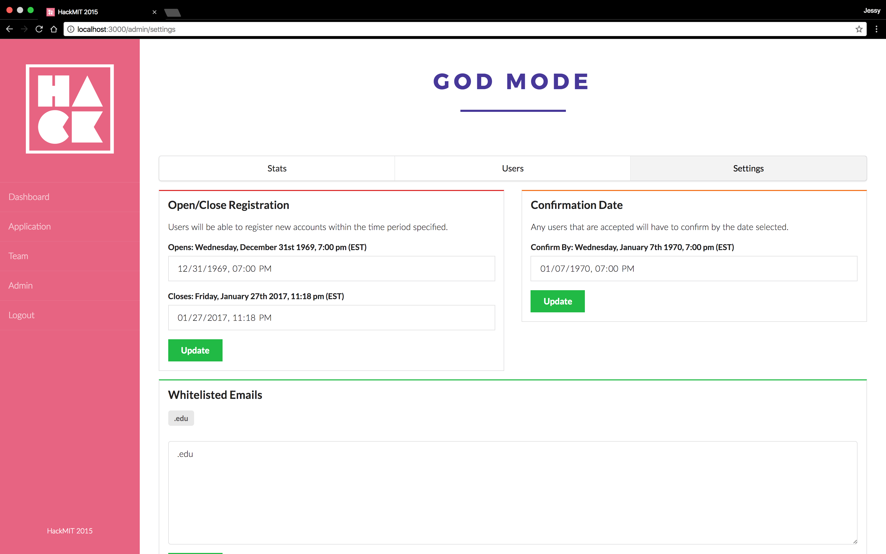

# Quill

## *Registration, for hackers!*

[](code-of-conduct.md)
[](https://www.gnu.org/licenses/agpl-3.0)
[](https://app.dependabot.com/accounts/krubenok/repos/204301089)
[](https://www.codacy.com/manual/krubenok/quill?utm_source=github.com&amp;utm_medium=referral&amp;utm_content=krubenok/quill&amp;utm_campaign=Badge_Grade)

Quill is a registration system designed especially for hackathons. For hackers, it’s a clean and streamlined interface to submit registration and confirmation information. For hackathon organizers, it’s an easy way to manage applications, view registration stats, and more!


## Table of Contents
- [Quill](#quill)
  - [*Registration, for hackers!*](#registration-for-hackers)
  - [Table of Contents](#table-of-contents)
  - [Features](#features)
    - [Quill for Hackers](#quill-for-hackers)
      - [Dashboard](#dashboard)
      - [Application](#application)
      - [Team Registration](#team-registration)
    - [Quill for Admins](#quill-for-admins)
      - [Stats](#stats)
      - [Users Table](#users-table)
      - [Settings](#settings)
  - [Setup](#setup)
    - [Requirements](#requirements)
    - [Local Deployment](#local-deployment)
      - [MongoDB](#mongodb)
      - [SMTP](#smtp)
      - [Quill](#quill-1)
    - [Deploying for your hackathon](#deploying-for-your-hackathon)
      - [MongoDB](#mongodb-1)
      - [SMTP](#smtp-1)
      - [Quill](#quill-2)
  - [Customizing for your event](#customizing-for-your-event)
    - [Copy](#copy)
    - [Branding / Assets](#branding--assets)
    - [Application questions](#application-questions)
    - [Email Templates](#email-templates)
  - [CI/CD and Automation](#cicd-and-automation)
    - [Build and Test](#build-and-test)
    - [Lint](#lint)
    - [Publish to Docker Hub](#publish-to-docker-hub)
    - [Automated Dependency Updates](#automated-dependency-updates)
  - [Testing](#testing)
    - [Jest](#jest)
    - [Accessibility](#accessibility)
  - [Contributing](#contributing)
  - [Feedback / Questions](#feedback--questions)
  - [License](#license)

## Features

### Quill for Hackers

#### Dashboard


After users login, the Dashboard displays the user’s application status and status-specific prompts to resend a verification email, view/edit their application or confirmation forms.

*Statuses:*

- Unverified: users have not verified the email address they registered with
- Incomplete, registration open: the user has not submitted their application, but the registration deadline has not passed
- Incomplete, registration closed: the user has not submitted, but the registration deadline has passed
- Submitted, registration open
- Submitted, registration closed
- Admitted / unconfirmed: the user has been admitted to the event, but has not confirmed their attendance and submitted their confirmation form
- Admitted / confirmation deadline passed: the user has been admitted, but did not confirm their attendance before the deadline
- Waitlisted: the user was not admitted to the event
- Confirmed: the user has been admitted and has confirmed their attendance
- User declined admission: the user has been admitted, but will not be attending the event

#### Application


The Application tab takes users to their registration or confirmation form.

#### Team Registration

Hackathons commonly allow participants to register and be admitted as a team. The Team tab allows users to create or join a team with other users.

### Quill for Admins

Admins can view stats, look through applications, or edit settings from the Admin panel.

#### Stats


The Stats tab summarizes useful registration statistics on the number of users in each stage of the process, demographic information, and miscellaneous event preferences like shirt sizes, dietary restrictions, or reimbursement requests.

#### Users Table


*The Users tab displays a table of users where admins can:*

1. Search for a user by name
2. Quick-view user applications in a pop-up modal
3. See a user’s application status (verified, submitted, admitted, and confirmed) at-a-glance
4. See responses to other miscellaneous fields on the application
5. Open and edit an individual application
6. Admit users manually
7. Mark users as checked-in at the event day-of

#### Settings



On the Settings tab, admins can easily control their event application timeline by setting registration / confirmation deadlines. They can also write custom waitlist, acceptance, and confirmation copy that users will see on their dashboard throughout the application process. The custom copy is interpreted as Markdown, so HTML and images can be added.

## Setup

[](https://heroku.com/deploy)

### Requirements

| Requirement                  | Version  |
| ---------------------------- | -------- |
| [Node.js](http://nodejs.org) | `10.13+` |
| [MongoDB](www.mongodb.com/)  | `4.0+`   |

Run the following commands to check the current installed versions:

```bash
node -v
mongo --version
```

*How to upgrade to latest releases:*

- Node.js: <https://nodejs.org/en/download/>
- MongoDB: <https://docs.mongodb.com/manual/administration/install-community/>

Additonally, there is an `.nvmrc` file in the root of the project. You can use [Node Version Manager (nvm)](https://github.com/nvm-sh/nvm) to make sure you are using the right version of node for this and other projects! This also ensures that any cloud deployments of the project use the same version of Node.

We use `dotenv` to keep track of environment variables, so be sure to stop tracking the `.env` file in Git:

```bash
git update-index --assume-unchanged .env
```

After doing this, fill in the environment variables in the `.env` before running Quill.

### Local Deployment

#### MongoDB

Ideally, you should run MongoDB as a daemon with a secure configuration (with most linux distributions, you should be able to install it with your package manager, and it'll be set up as a daemon). Although not recommended for production, when running locally for development, you could do it like this

```bash
mkdir db
mongod --dbpath db --bind_ip 127.0.0.1
```

#### SMTP

This step is only required if you want to test the email-related functionality of Quill. The easiest option is to use the SMTP server provided by your personal email (Gmail, Outlook, etc.). Look for the documentation about SMTP for your respective email and fill in the values in the `.env` accordingly. Be warned that sending many emails this way is not recommended and this method should only be used for testing. In particular, note that Gmail will require you to enable less secure apps in your security settings before Quill will be able to send email.

#### Quill

Install the necessary dependencies:

```bash
npm install
```

Ensure you have filled in the `.env` according to your setup, and then run the application:

```bash
gulp server
```

### Deploying for your hackathon

#### MongoDB

The database can either be hosted with a cloud-hosted MongoDB provider, such as [MongoDB Atlas](https://www.mongodb.com/cloud/atlas), or on your own server. Cloud-hosted MongoDB will generally be easier to set up and should be the preferred choice unless you are familiar with administering your own server. A guide to setting up Atlas can be found [here](https://docs.atlas.mongodb.com/getting-started/). Note that the URI for the database (which must be specified in `.env`) will be different depending on where your database is hosted. If you use the "Deploy the Heroku" button in this document, a MongoDB instance will automatically be spawned via Heroku.

#### SMTP

A dedicated SMTP provider is absolutely required if you want Quill to work for your hackathon. There are several providers available such as [Mailgun](https://www.mailgun.com) or [Sendgrid](https://sendgrid.com), both part of the GitHub Student Developer Pack. After setting this up, fill in the `.env` with the values that your provider gives you.

#### Quill

There are also several options for hosting Quill itself. You can use Heroku by clicking the __Deploy to Heroku__ button above where, after making a Heroku account, you will be able to set the configuration variables and deploy Quill. A Dockerfile has also been provided to make it easy to run Quill in a Docker container either on your own server or with your preferred cloud service provider. Don't forget to publish the container's port `3000` to the host machine. If using the command line, this is done by using the `-p` flag and specifying which port on the host machine should redirect to port 3000 on the container.

## Customizing for your event

*_If you're using Quill for your event, please add yourself to this [list][users]. It takes less than a minute, but knowing that our software is helping real events keeps us going ♥_*

### Copy

If you’d like to customize the text that users see on their dashboards, edit them at `client/src/constants.js`.

### Branding / Assets

Customize the color scheme and hosted assets by editing `client/stylesheets/_custom.scss`. Don’t forget to use your own email banner, favicon, and logo (color/white) in the `assets/images/` folder as well!

### Application questions

If you want to change the application questions, edit:

- `client/views/application/`
- `server/models/User.js`
- `client/views/admin/user/` and `client/views/admin/users/` to render the updated form properly in the admin view

If you want stats for your new fields:

- Recalculate them in `server/services/stats.js`
- Display them on the admin panel by editing `client/views/admin/stats/`

### Email Templates

To customize the verification and confirmation emails for your event, put your new email templates in `server/templates/` and edit `server/services/email.js`

## CI/CD and Automation

### Build and Test

`.github/workflows/build.yml` contains a Github Action for building and running the project. The only test currently run is to check that a GET request of `/login` returns a status code `200`. This should be expanded in future with thorough unit testing. The Github action spawns a Docker instance of MongoDB for the application to connect to and utilizes the NodeJS version as specified in the `.nvmrc` file. *This action is run automatically on each push to any branch*.

### Lint

`.github/workflows/link.yml` contains a Github Action for linting the project. The action is currently using ESLint to achieve this with a *very* minimal ruleset (currently only checking for semi-colon rules). This should be modified to include an opinionated style checker such as [AirBnb's](https://github.com/airbnb/javascript). *This action is run automatically on each push to any branch*.

### Publish to Docker Hub

`.github/workflows/dockerimage.yml` conatins a Github Action for building and publishing a Docker Image to the Docker Hub. The action takes the docker file at `.Dockerfile` and publishes it to the account specified in the Github Secrets. *This action is run automatically on each merge to the `master` branch*

**[The following secrets need to be added to the repository](https://help.github.com/en/actions/automating-your-workflow-with-github-actions/creating-and-using-encrypted-secrets)**

- DOCKER_USER => your docker hub username
- DOCKER_PASS => your docker hub password*

**[Using a Token rather than a password for this is probably a good idea.](https://www.docker.com/blog/docker-hub-new-personal-access-tokens/)**

This will output an image in Docker Hub located at $DOCKER_USER/quill:latest

### Automated Dependency Updates

The repository has been signed up to Dependabot, an automated dependency management tool. Dependabot automatically checks for updates for any outdated or insecure requirements and it will open a pull request for each one of them. To parametrize the tool further please [look here.](https://dependabot.com/docs/config-file/)

### Notifications [on Push]

This project has been set up to run workflows that send notifications to a Discord server and a Slack workspace when changes are pushed. The secrets required to run these must be set by the admin according to the documentation of each implementation (configuration links). 

* `.yml` file information has already been added to the repository under `.github/workflows/notify.yml` and individual platforms may be removed by editing this file.

##### Discord Notification
[Configuring the action to send notifications to your organization's Discord server can be found here.](https://github.com/Ilshidur/action-discord)

* Note that leaving `/github` at the end of the `DISCORD_WEBHOOK` token (contrary to what the action recommends)  will use the default GitHub webhook settings in addition to sending this action's notification. We suggest leaving it if there is no webhook already configured.

##### Slack Notification
[Configuring the action to send notifications to your organization's Slack workspace can be found here.](https://github.com/marketplace/actions/slack-notify)

## Testing

### Jest

Basic Jest testing has been implemented in the `test.js` file. Currently the only test is to check that the `/login` page returns a HTTP 200 status code. These tests can be run using the `npm run test` command. More Jest tests including snapshots and unit tests should be added as features are created or updated. 

### Accessibility

Testing for accessibility is a great way to make sure that all hackathon enthusiasts can use Quill, regardless of ability. It's good practice to run accessibility tests on any changes that you've made to ensure that no new accessibility errors were introduced.

An accessibility testing tool, pa11y-ci, has been provided and configured for this project. To run pa11y-ci, make sure that Quill is running locally on http://localhost:3000/ (alternatively, you can change the URLs specified in `.pa11yci` to match those of your running instance). Then, run the command `npm run test:accessibility`. If several of the URLs checked by pa11y-ci produce the same number of errors, pa11y-ci may be having trouble logging in with the default admin credentials specified in `.env`. Check that your instance of Quill is running correctly, or change the credentials used in `.pa11yci`.

If your contribution adds any new pages to Quill, please add them to `.pa11yci` to make sure that these pages are covered by the accessibility tests. If your new pages are accessed as a non-logged-in user, add them at the beginning of the URL list. If they are accessed when logged in, add them after the URL with actions to log in.

For more information on pa11y-ci, please visit [pa11y-ci] and [pa11y], in particular the [section on actions][pa11y-actions].


## Contributing

Contributions to Quill are welcome and appreciated! Please take a look at [`CONTRIBUTING.md`][contribute] first.

## Feedback / Questions

If you have any questions about this software, please contact [quill@hackmit.org][email].

## Contributors

### Code Contributors

This project exists thanks to all the people who contribute. [[Contribute](CONTRIBUTING.md)].
<a href="https://github.com/techx/quill/graphs/contributors"></a>

### Financial Contributors

Become a financial contributor and help us sustain our community. [[Contribute](https://opencollective.com/techx/contribute)]

#### Individuals

<a href="https://opencollective.com/techx"></a>

#### Organizations

Support this project with your organization. Your logo will show up here with a link to your website. [[Contribute](https://opencollective.com/techx/contribute)]

<a href="https://opencollective.com/techx/organization/0/website"></a>
<a href="https://opencollective.com/techx/organization/1/website"></a>
<a href="https://opencollective.com/techx/organization/2/website"></a>
<a href="https://opencollective.com/techx/organization/3/website"></a>
<a href="https://opencollective.com/techx/organization/4/website"></a>
<a href="https://opencollective.com/techx/organization/5/website"></a>
<a href="https://opencollective.com/techx/organization/6/website"></a>
<a href="https://opencollective.com/techx/organization/7/website"></a>
<a href="https://opencollective.com/techx/organization/8/website"></a>
<a href="https://opencollective.com/techx/organization/9/website"></a>

# License
Copyright (c) 2015-2016 Edwin Zhang (https://github.com/ehzhang). Released under AGPLv3. See [`LICENSE.txt`][license] for details.

[contribute]: https://github.com/techx/quill/blob/master/CONTRIBUTING.md
[license]: https://github.com/techx/quill/blob/master/LICENSE
[email]: mailto:quill@hackmit.org
[users]: https://github.com/techx/quill/wiki/Quill-Users
[pa11y-ci]: https://github.com/pa11y/pa11y-ci
[pa11y]: https://github.com/pa11y/pa11y
[pa11y-actions]: https://github.com/pa11y/pa11y#actions
