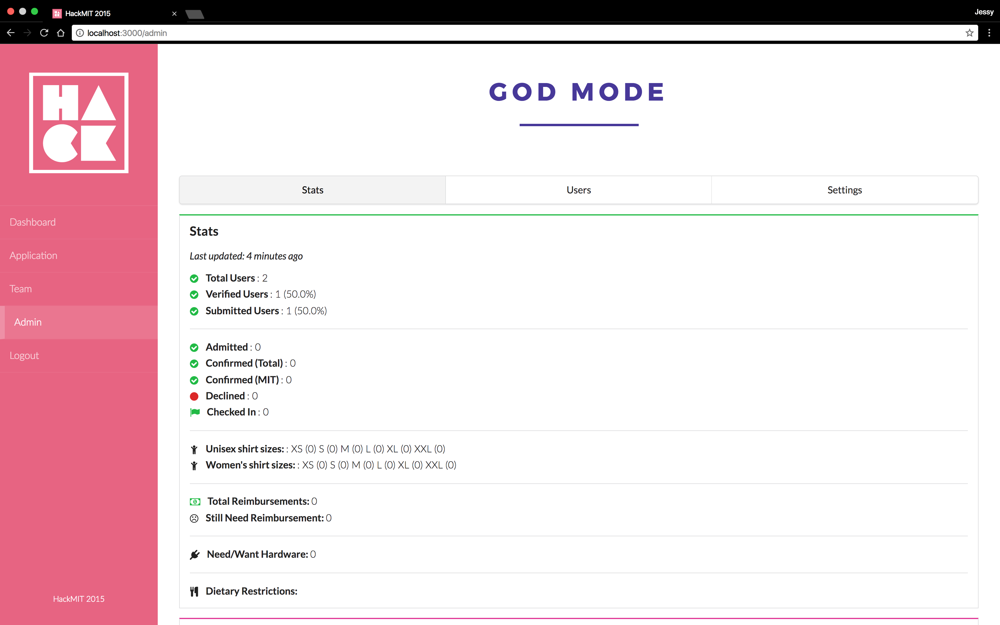

Quill
======
Registration, for hackers!

Quill is a registration system designed especially for hackathons. For hackers, it’s a clean and streamlined interface to submit registration and confirmation information. For hackathon organizers, it’s an easy way to manage applications, view registration stats, and more!


Features
--------
#### Users


After users login, the **Dashboard** displays the user’s application status and status-specific prompts to resend a verification email, view/edit their application or confirmation forms.

Statuses:
- Unverified
- Incomplete, registration open
- Incomplete, registration closed
- Submitted, registration open 
- Submitted, registration closed
- Admitted / unconfirmed
- Admitted / confirmation deadline passed
- Waitlisted
- Confirmed
- User declined admission

The **Application** tab takes users to their registration or confirmation form. 

Hackathons commonly allow participants to register and be admitted as a team. The **Team** tab allows users to create or join a team with other users.
Admin
Admins can view stats, look through applications, or edit settings from the **Admin** panel.

 

The **Stats** tab summarizes useful registration statistics on the number of users in each stage of the process, demographic information, and miscellaneous event preferences like shirt sizes, dietary restrictions, or reimbursement requests.


The **Users** tab displays a table of users where admins can:
1. Search for a user by name
2. Quick-view user applications in a pop-up modal
3. See a user’s application status (verified, submitted, admitted, and confirmed) at-a-glance
4. See responses to other miscellaneous fields on the application
5. Open and edit an individual application
6. Admit users manually
7.  Mark users as checked-in at the event day-of
                             


On the **Settings** tab, admins can easily control their event application timeline by setting registration / confirmation deadlines. They can also write custom waitlist, acceptance, and confirmation copy that users will see on their dashboard throughout the application process.

Setup
------

Getting a local instance of Quill up and running takes less than 5 minutes! Start by installing the necessary dependencies:
```
mkdir db
npm install
bower install
npm run config
```

Edit the configuration file in ```.env``` for your application, and then run it:
```
npm run mongo
gulp server
```

Customizing for your event
--------------------------
#### Copy
If you’d like to customize the text that users see on their dashboards, edit them at ```client/src/constants.js```.

#### Branding / Assets
Customize the color scheme by editing ```client/stylesheets/_colors.scss```, and upload your own login splash at ```client/stylesheets/_asset_urls.scss.``` Don’t forget to use your own email banner, favicon, and logo (color/white) in the ```assets/images``` folder as well! 

#### Application questions
If you want to change the application questions, take a look at ```client/views/application/application``` on the front-end, ```server/models/User.js``` on the back-end, and ```client/admin/user```,```client/admin/users``` to render the updated form properly in the admin view. If you want stats for your new fields, recalculate them in ```server/services/stats.js``` and display them on the admin panel by editing ```client/admin/stats/````. 

#### Email Templates
To customize the verification and confirmation emails for your event, put your new email templates in ```server/templates``` and edit ```server/services/email.js```. 

Contributing
------------
Contributions to Quill are welcome and appreciated! Please take a look at ```CONTRIBUTING.md``` first.

Feedback / Questions
------------------
If you have any questions about this software, please contact team@hackmit.org.

License
-------
Copyright (c) 2015-2016 Edwin Zhang (https://github.com/ehzhang). Released under AGPLv3. See ```LICENSE.txt``` for details.


